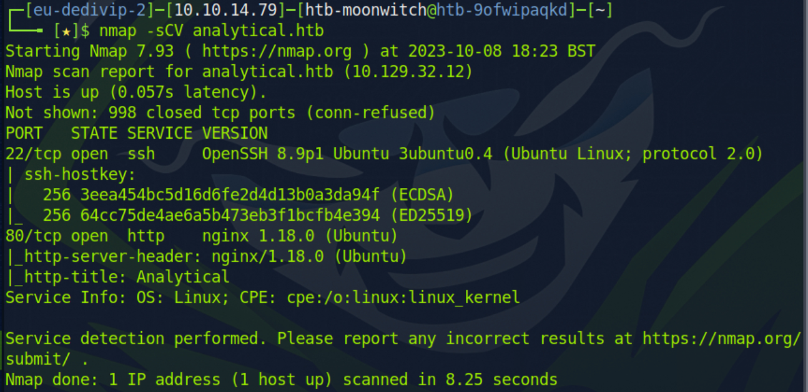
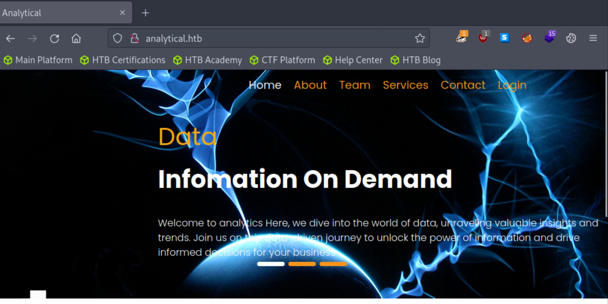
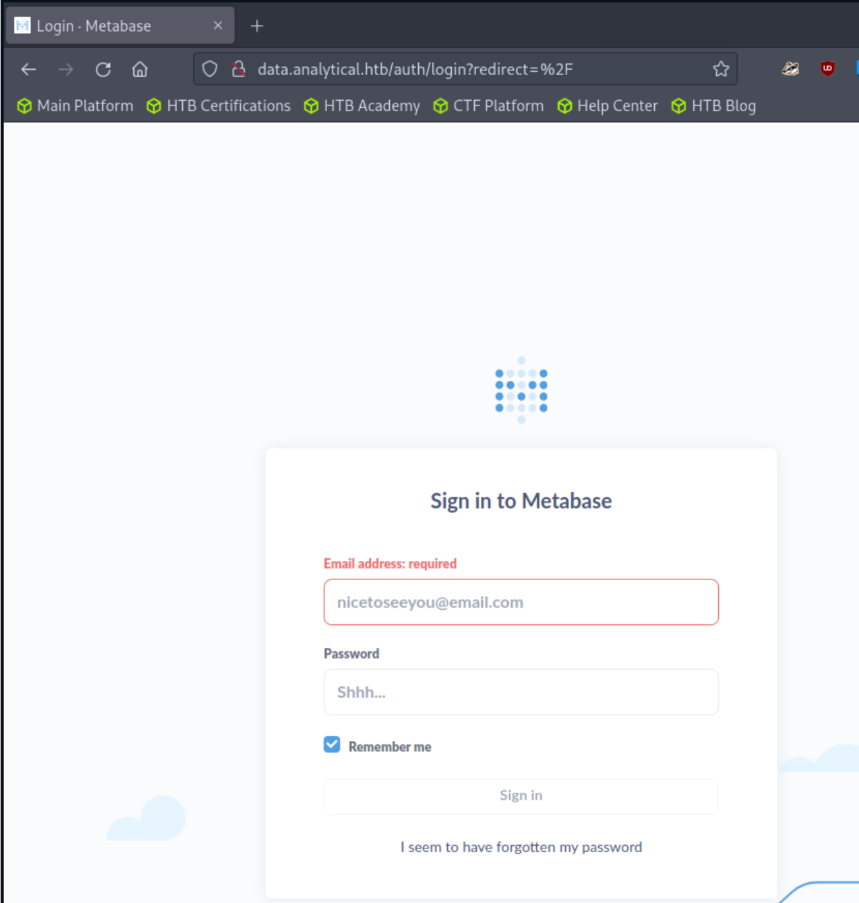
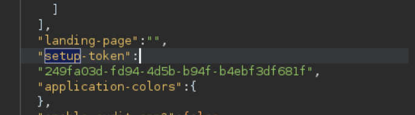

# Seasonal 3 2023 - Analytical; Linux Easy

```bash
echo "${box-ip} analytical.htb" | sudo tee -a /etc/hosts
```

1. Recon with nmap `nmap -sCV analytical.htb`
  Shows the following ports to be open; 
  - 22/tcp
  - 80/tcp



This tells me we need to use the browser, so off we go. It's a simple site with a login option. 



The login menu is actually pointing to [data.analytical.htb](data.analytical.htb), which is leads to a 404. So we need to add that one to our hosts file as well. And then we reach a login page "Sign in to Metabase"



So we'll just drop to our trusted burpsuite.

We also hit google to find out more on metabase; googling for 'metabase+exploit' we find :

[CVE-2023–38646 — Metabase Pre-Auth RCE | by shamooo | Aug, 2023 | InfoSec Write-ups (infosecwriteups.com)](https://infosecwriteups.com/cve-2023-38646-metabase-pre-auth-rce-866220684396)

That google search was amazing, we have a setup-token.



So, we know [shamo0/CVE-2023-38646-PoC: Metabase Pre-auth RCE (github.com)](https://github.com/shamo0/CVE-2023-38646-PoC?source=post_page-----866220684396--------------------------------) can be used. [Chaining our way to Pre-Auth RCE in Metabase (CVE-2023-38646) – Assetnote](https://blog.assetnote.io/2023/07/22/pre-auth-rce-metabase/)