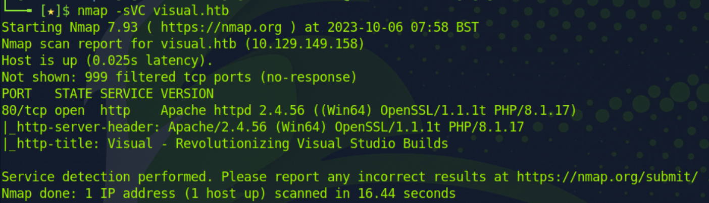
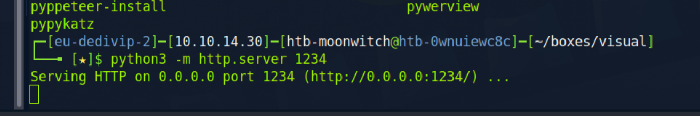
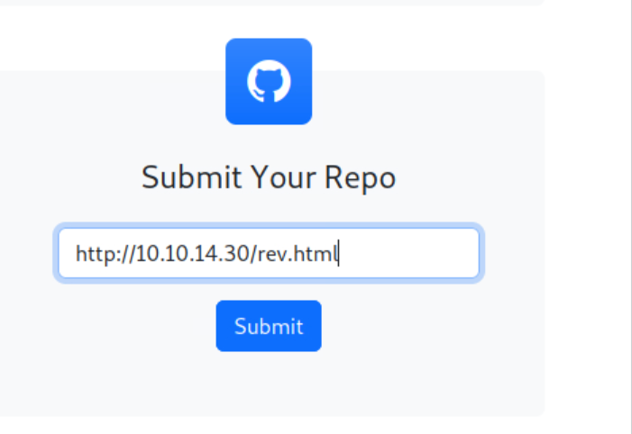

# Write-Up: Visual

__OS__ -> Windows
__Level__ -> Medium

## Handy tips

I always enter the IP - hostname into my /etc/hosts, this is simply faster for me to type. 

`echo "${TARGET_IP} visual.htb" | sudo tee -a /etc/hosts`

## Initial recon

Start off with `nmap -sCV ${TARGET_IP}`
This gets you the results you need; there's an opening, a web server running on tcp/80.



Needless to say, we check that out. 


Since I know it's a site, I'll go on and check  the used stack with Wappalyzer; this tells me that we're using 

- Bootstrap icons 1.4.1
- Apache 2.4.56
- php 8.1.17
- openssl 1.1.1t
- Bootstrap 5.1.3

I also notice we've got an upload box option - or rather a link option. Me being me, I'll input 'http://localhost' to see what happens.


So we try a random reverse shell; I opted for php cmd on revshells.com. You drop that into a file; and serve it with `python -m http.server 1234`





We get an error, it needs to be a git repo and needs to contain an sln file. SLN is a dotnet solution file. 

So we're going to fix that.

First git repo :)

```bash
git init htb-visual
cd htb-visual/.git
cd .git && git --bare update-server-info && mv hooks/post-update.sample hooks/post-update && cd ../..
```

And we serve this with a python webserver to use that to submit on the site.

```bash
python -m http.server 8000
```

It's important to skip the trailing, otherwise the git repo won't get loaded properly. I also start the python web server in the root/root. (eg. /home/user/visual/ and not /home/user/visual/fakerepo)
